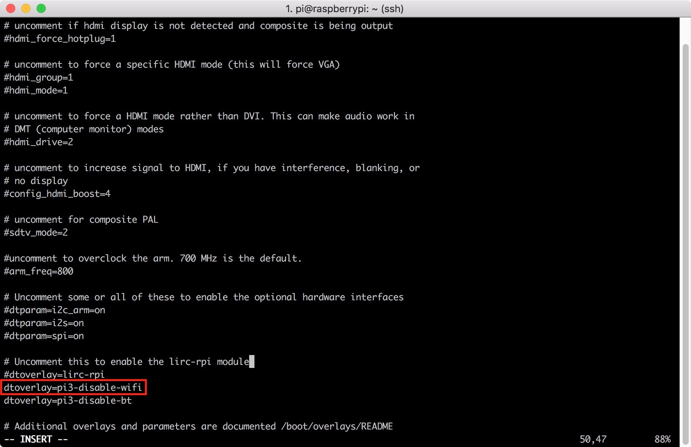
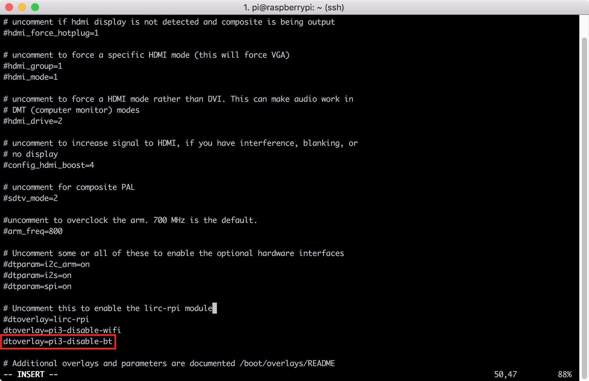
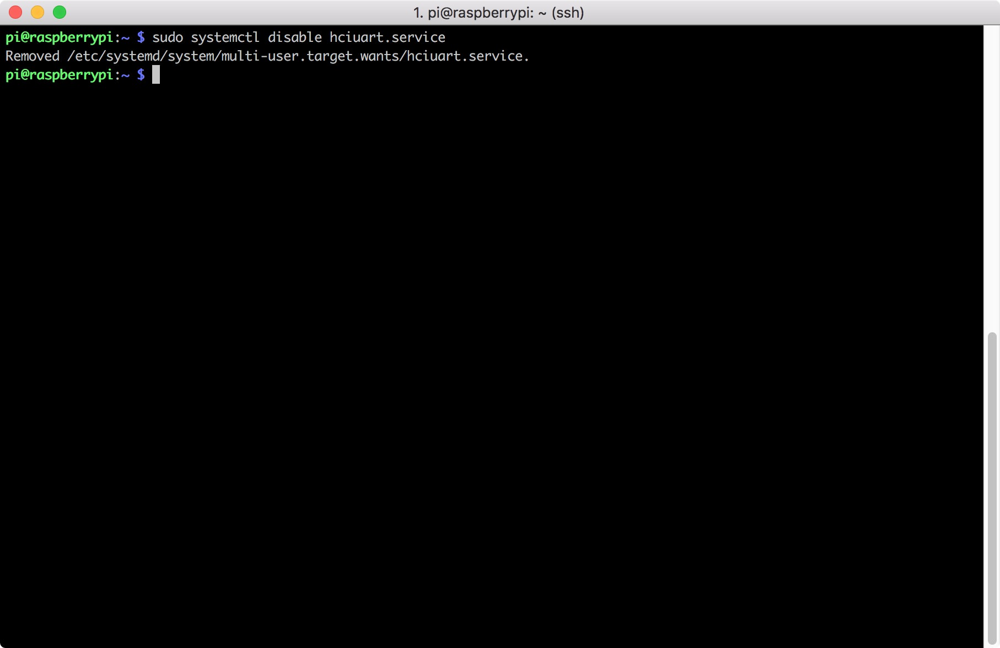
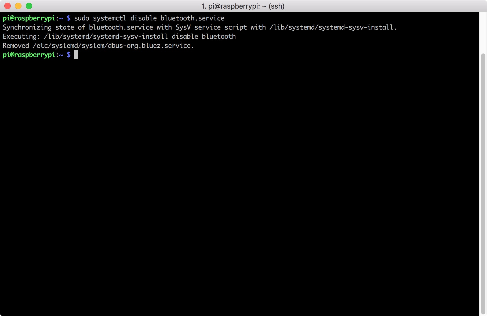

# RPi3 Disable Bluetooth Or WiFi By Default

## Step
1. Use ```sudo mount /dev/mmcblk0p1 /mnt``` to mount SD Card


2. Use ```sudo vim /mnt/config.txt``` to edit config


3. Disable WiFi
    Add the following script to disable WiFi
    ```
    dtoverlay=pi3-disable-wifi
    ```
    

4. Disable Bluetooth
    Add the following script to disable Bluetooth
    ```
    dtoverlay=pi3-disable-bt
    ```
    

5. And then use the following script to shutdown the services of bluetooth
    ```
    sudo systemctl disable hciuart.service
    ```
    
    Then
    ```
    sudo systemctl disable bluetooth.service
    ```
    

6. Reboot
    ```
    sudo reboot
    ```
    

7. Now you can use ```iwconfig``` to check if the WiFi is disabled


8. Also can use ```hciconfig``` to check if the Bluetooth is disabled


# Note
I don't know why if I use ```sudo systemctl disable bluealsa.service``` to disable bluealsa,<br>
the raspberry pi will show this :<br>
**```Failed to disable unit: No such file or directory```**<br>

Maybe Raspbian-Stretch has remove this service by default ?