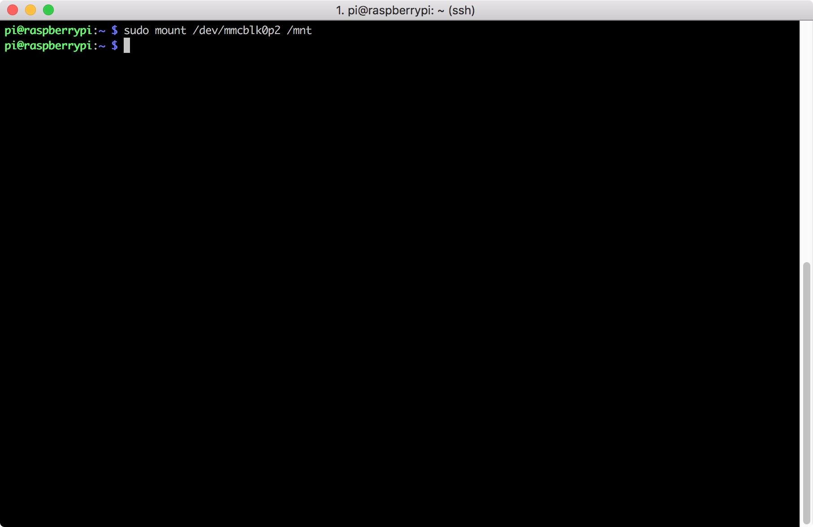
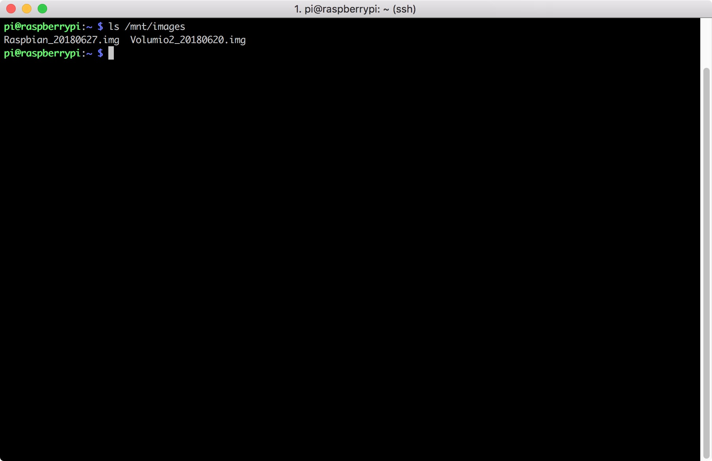
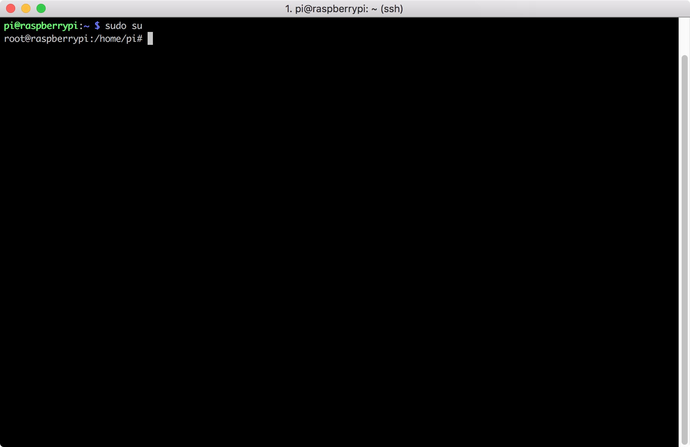
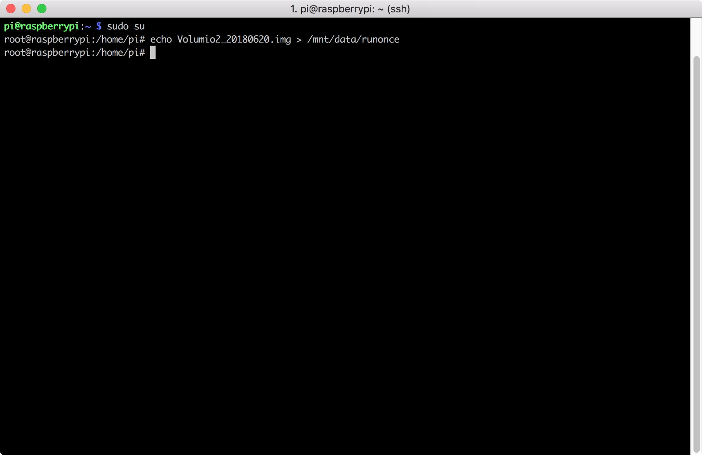
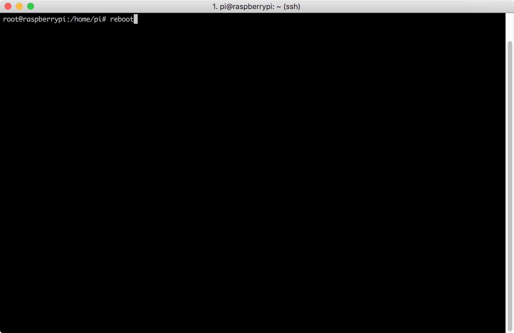

# RPi3 Change Berryboot Default System By SSH

## Step
1. Use ```sudo mount /dev/mmcblk0p2 /mnt``` to mount raw storage


2. Use ```ls /mnt/images``` to check what the full file name of the operating you would like to run


3. Use ```sudo su``` to change user into root


4. Write out the desired image file's name to "runonce":<br>
```echo [filename_of_operating_system].img[memsplit amount] > /mnt/data/runonce```<br>
For example: ```echo Raspbian.img128 > /mnt/data/runonce```


5. Reboot


## Note
That this will only change the booted OS for the next reboot. 
You could probably change the default by changing the 4th step to the following:<br>
```echo -n [filename_of_operating_system].img[memsplit amount] > /mnt/data/default ```