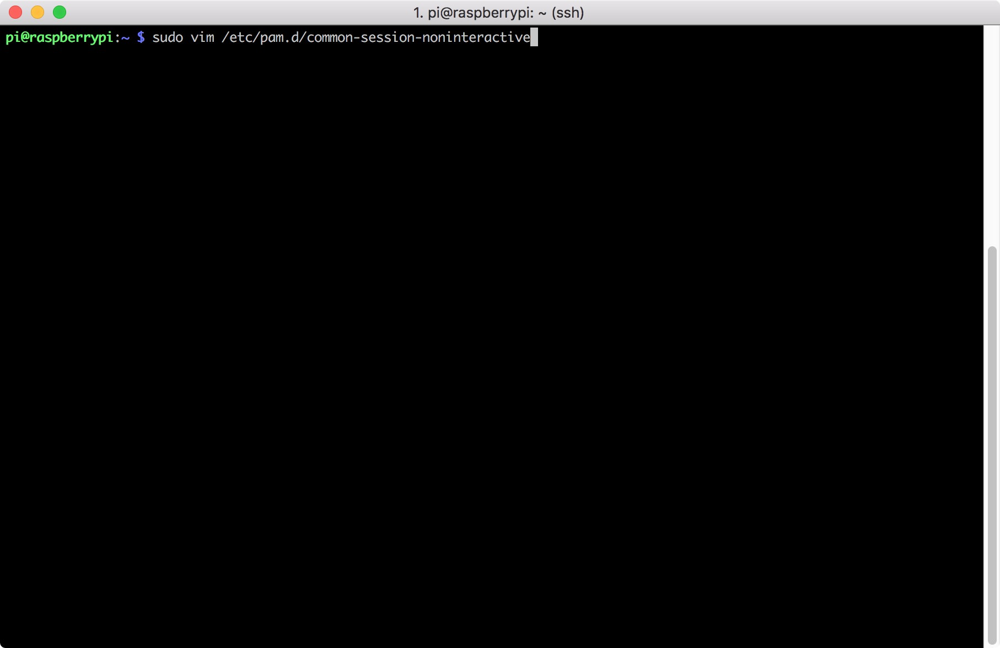
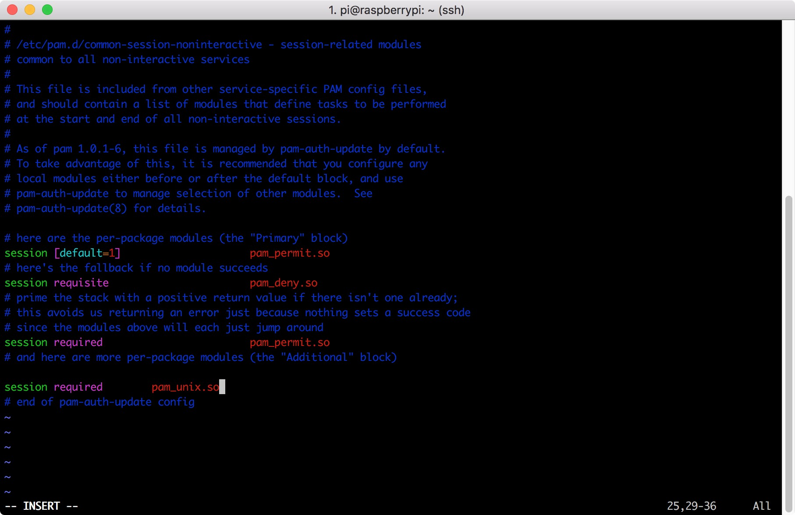
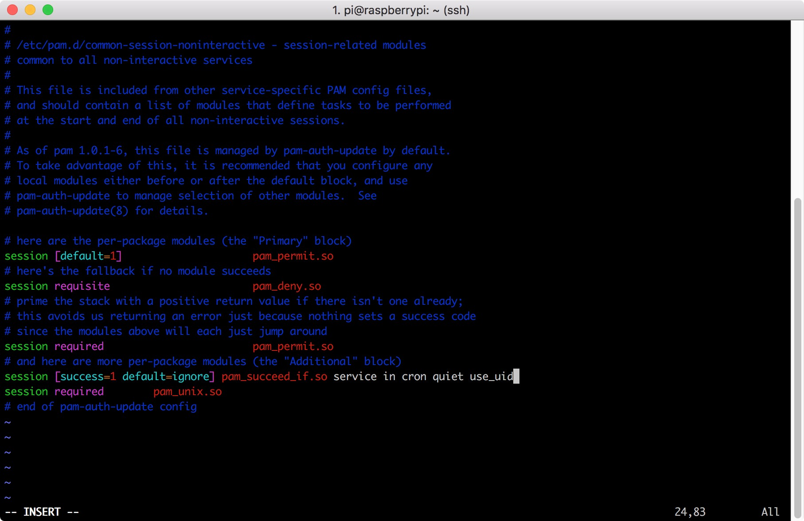
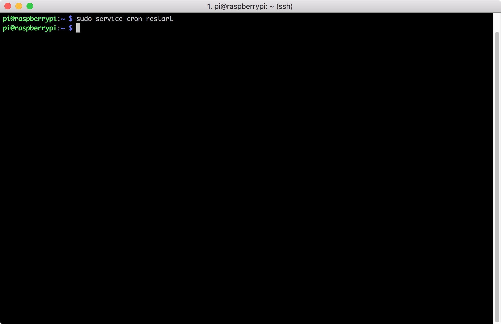

# Disable Cron Pam_Unix Session

## Step
1. Use ```sudo vim /etc/pam.d/common-session-noninteractive``` to edit the settings


2. Find this line
    ```
    session required pam_unix.so
    ```
    

3. Then add the following script on top of this line
    ```
    session [success=1 default=ignore] pam_succeed_if.so service in cron quiet use_uid
    ```
    

4. Restart cron service
    ```
    sudo service cron restart
    ```
    
    
5. Finish