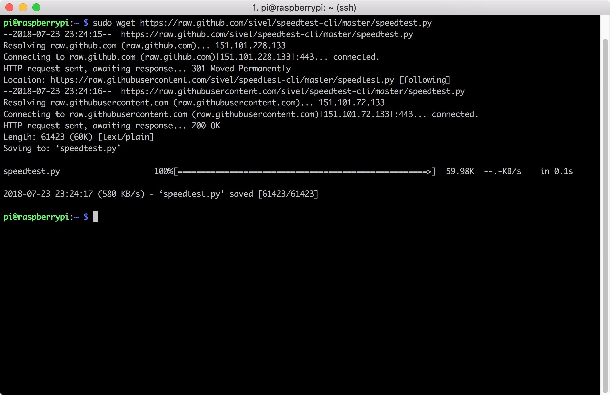
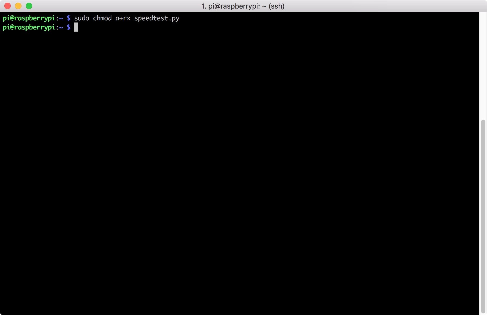
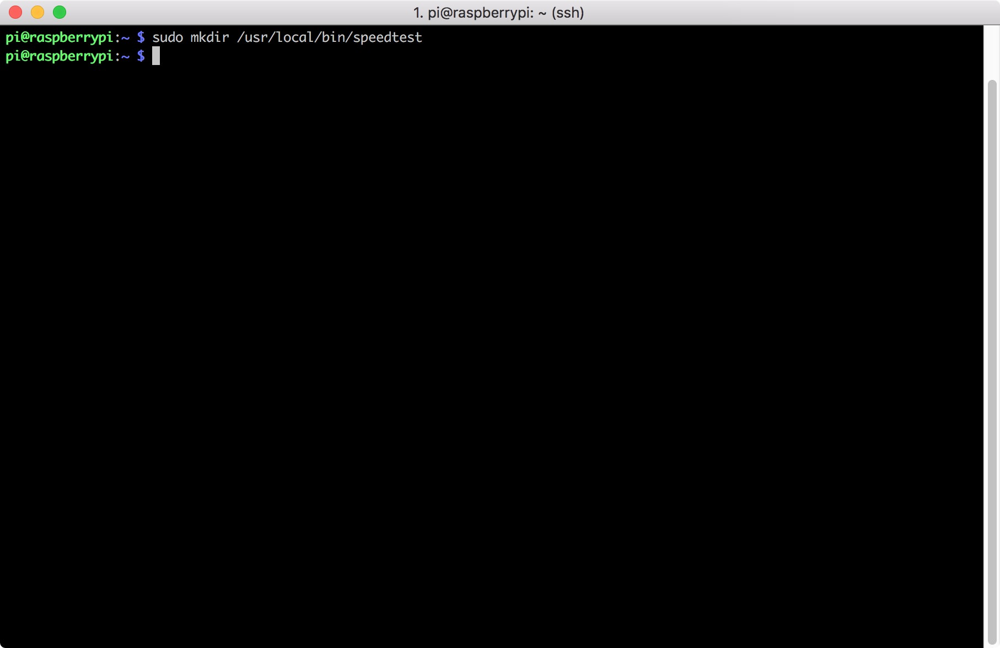
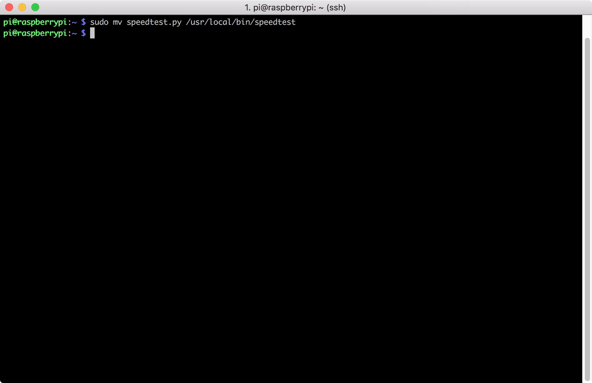
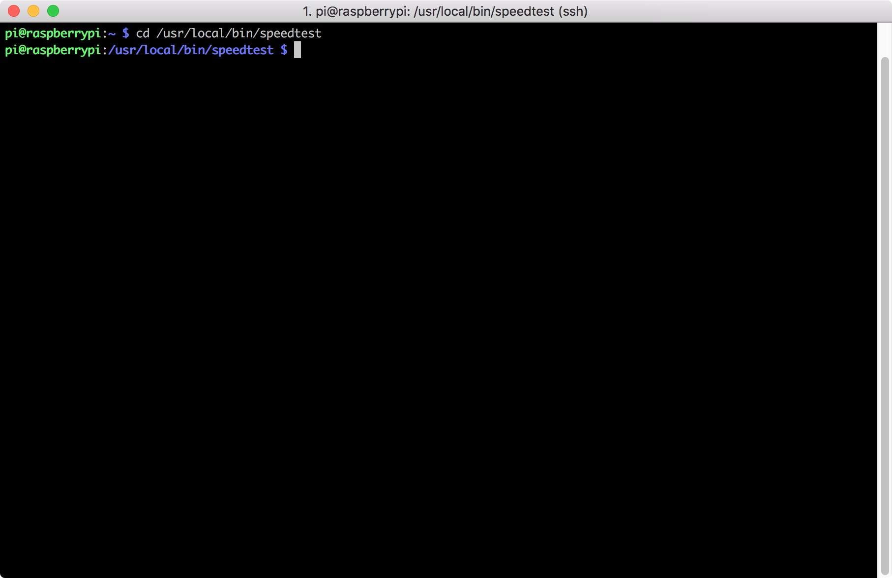
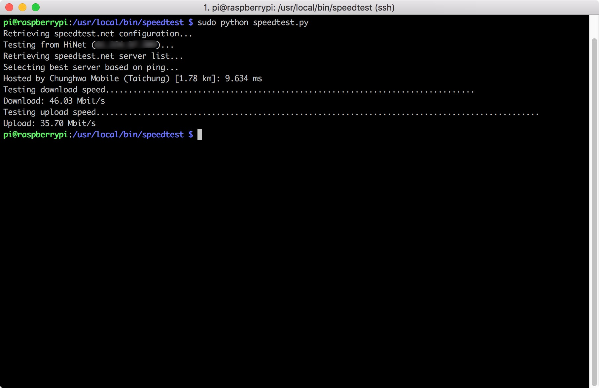
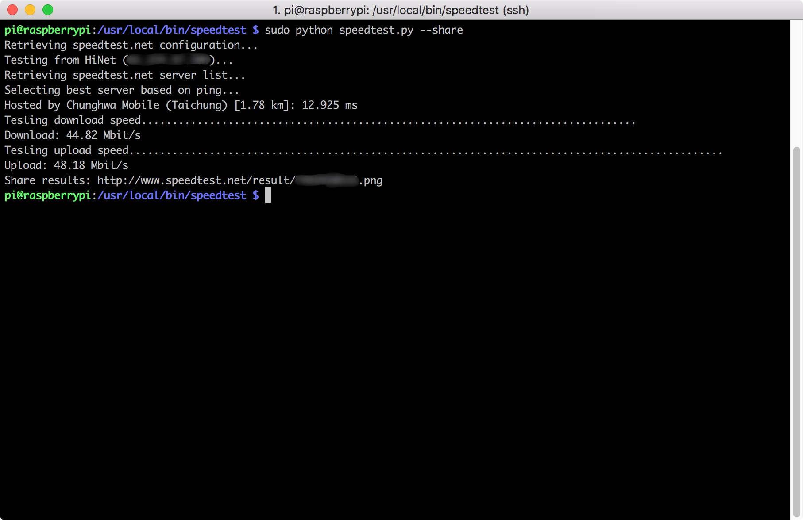

# Internet Speedtest

## Step
1. Download speedtest python script from Sivel
```sudo wget https://raw.github.com/sivel/speedtest-cli/master/speedtest.py```


2. Use ```sudo chmod a+rx speedtest.py``` to make **speedtest.py** can be executed


3. Use ```sudo mkdir /usr/local/bin/speedtest``` to create folder


4. Use ```sudo mv speedtest.py /usr/local/bin/speedtest``` to move ```speedtest.py``` to speedtest folder


5. Use ```sudo chown root:root /usr/local/bin/speedtest``` to change owner


6. Use ```cd /usr/local/bin/speedtest``` to go to speedtest folder


7. Use ```sudo python speedtest.py``` to run speedtest script


## Note
If you want to get the picture of test result, you can add ```--share``` on the end of the script<br>
```sudo python speedtest.py --share```

