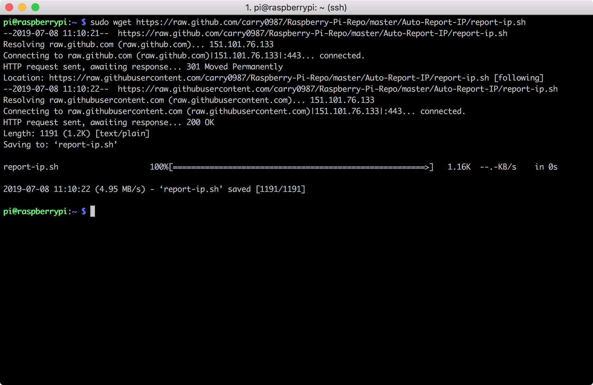
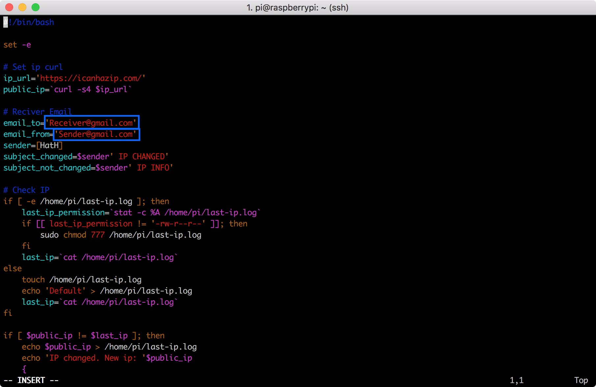
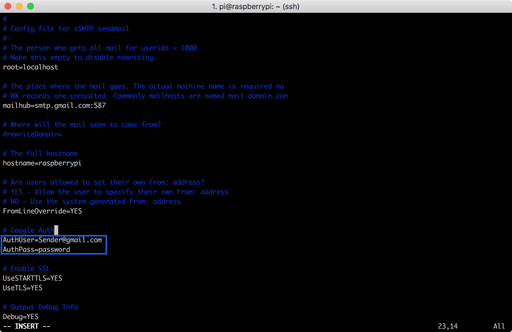
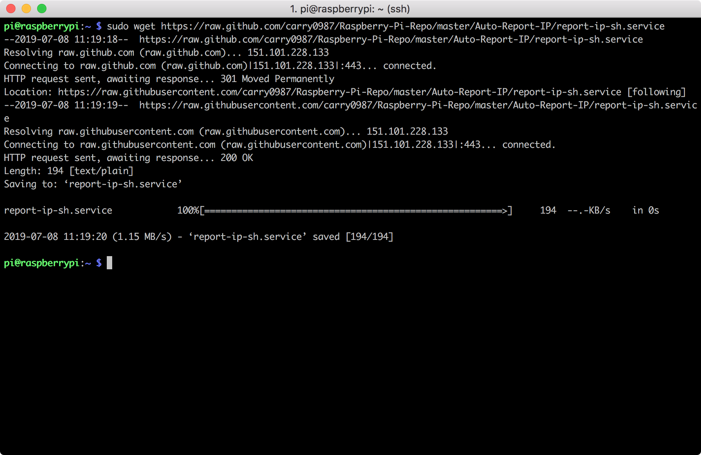
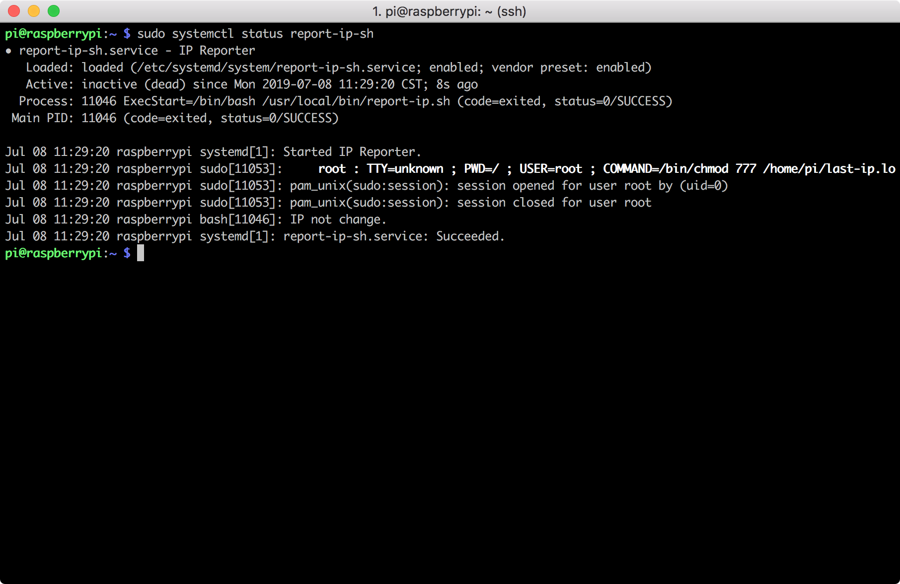
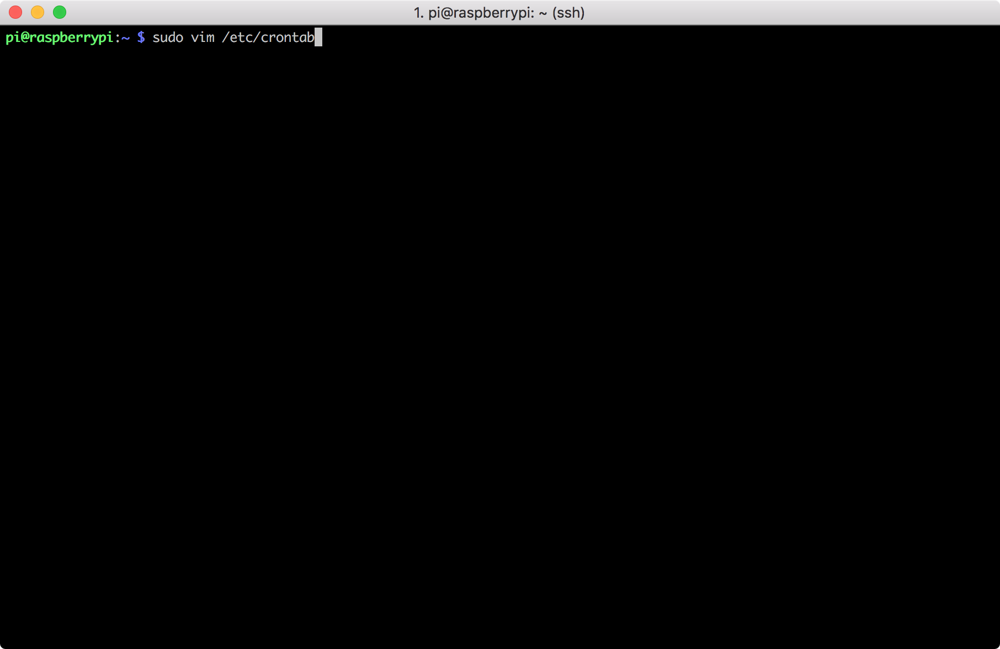
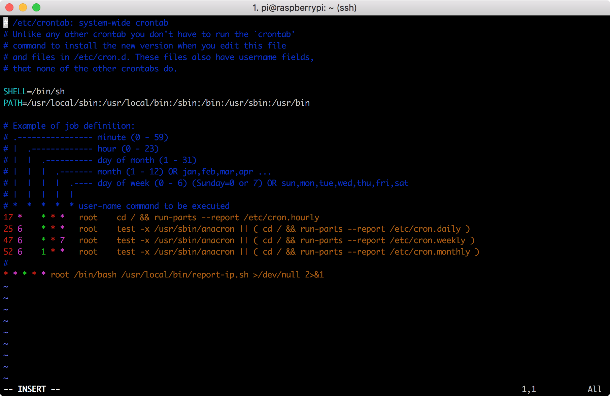
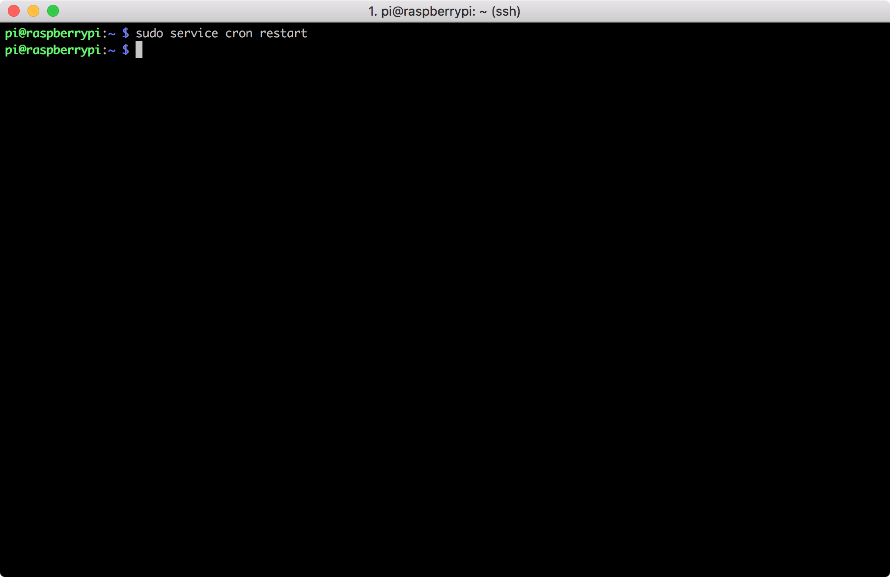

# RPi3 Auto Email New Public IP If Changed (Shell)

## Step
1. Use ```wget``` to download IP-Reporting script
    ```
    sudo wget https://raw.github.com/carry0987/Raspberry-Pi-Repo/master/Auto-Report-IP/report-ip.sh
    ```
    

2. Give the script executing permission
    ```
    sudo chmod +x report-ip.sh
    ```
    

3. Enter your gmail address and receiver email address to the script
    ```
    sudo vim report-ip.sh
    ```
    

4. Enter your gmail password to ```ssmtp.conf```
    ```
    sudo vim /etc/ssmtp/ssmtp.conf
    ```
    **Note :** If your gmail have set ```Two-Step Verification```, you should follow the step to get token:
    1. Log-in into Gmail with your account
    2. Navigate to https://security.google.com/settings/security/apppasswords
    3. In 'select app' choose 'custom', give it an arbitrary name and press generate
    4. It will give you 16 chars token
    5. Use the token as password with your Gmail account and two factor authentication will not be required.
    

5. Move ```report-ip.sh``` to usr folder
    ```
    sudo mv report-ip.sh /usr/local/bin
    ```
    

6. Create a systemd service to make the script will auto be run on boot
   It can auto check the network connection make sure the network is online so that it can send the email
    ```
     sudo wget https://raw.github.com/carry0987/Raspberry-Pi-Repo/master/Auto-Report-IP/report-ip-sh.service
    ```
    

7. Move ```report-ip-sh.service``` to systemd folder
    ```
    sudo mv report-ip-sh.service /etc/systemd/system
    ```
    

8. Enable the service
    ```
    sudo systemctl enable report-ip-sh
    ```
    

9. Start the service
    ```
    sudo systemctl start report-ip-sh
    ```
    

10. Use ```systemctl``` to check the status of the service
    ```
    sudo systemctl status report-ip-sh
    ```
    

11. Now edit **crontab** to make the script run every minutes
    ```
    sudo vim /etc/crontab
    ```
    

12. Add the following script on the bottom, then save and exit
    ```
    * * * * * root /bin/bash /usr/local/bin/report-ip.sh >/dev/null 2>&1
    ```
    

13. Restart **cron** service
    ```
    sudo service cron restart
    ```
    

14. Finish