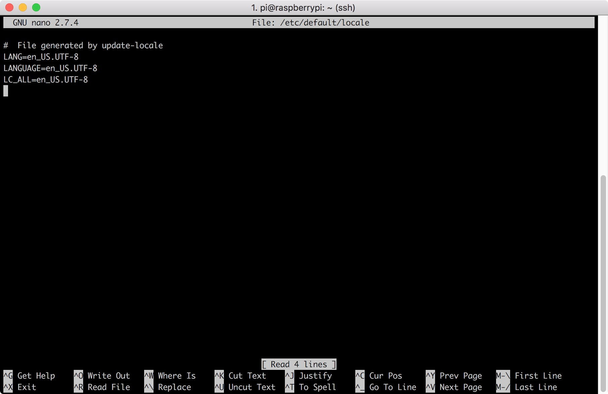

# RPi3 Set LC

## Required Tools
You can use Nano or Vim, here I use nano to edit locale

## Step
1. Use ```sudo nano /etc/default/locale``` to edit locale file<br>


2. Put following content into locale
    ```
    LANG=en_US.UTF-8
    LANGUAGE=en_US.UTF-8
    LC_ALL=en_US.UTF-8
    LC_TYPE=en_US.UTF-8
    ```
    
    
3. Save and exit<br>
    Press ```Ctrl+O``` and then ```Ctrl+X```